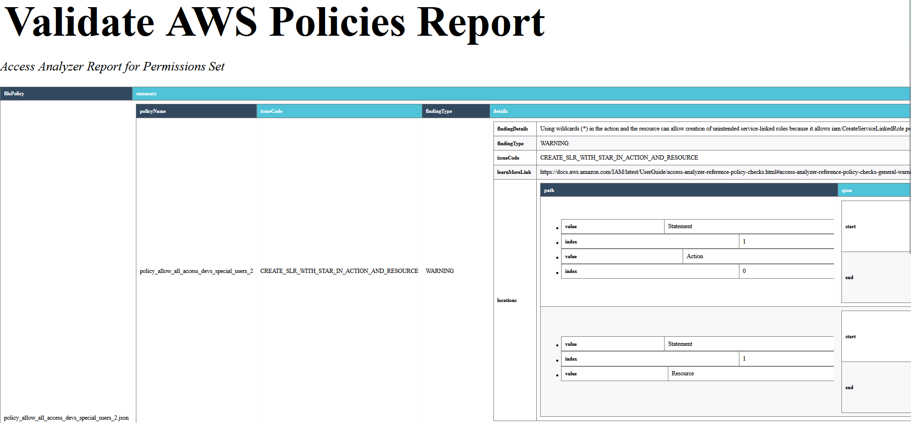

# Validate AWS Policies

A modern CLI tool to validate AWS policies using IAM Access Analyzer API and generate comprehensive reports.

## Features

- ✅ Validate AWS policies (SCP, Identity, Resource-based)
- 📊 Generate reports in multiple formats (JSON, Text, HTML, Markdown)
- 🔄 Support for batch validation
- ☁️ Upload reports to S3
- 📦 Create ZIP archives of reports
- 🎨 Beautiful HTML and Markdown reports
- ⚙️ Configuration file support (YAML/TOML)
- 🔍 Detailed validation findings with severity levels

## Quick Start

### Installation

```bash
pip install validate-aws-policies
```

Or with pipx:

```bash
pipx install validate-aws-policies
```

### Basic Usage

```bash
# Validate policies in a directory
validate-aws-policies --policies-path ./policies

# Generate HTML report
validate-aws-policies --policies-path ./policies --format html

# Generate all formats
validate-aws-policies --policies-path ./policies --format all

# Use specific AWS profile
validate-aws-policies --policies-path ./policies -p my-profile
```

## Requirements

- Python >= 3.8
- AWS CLI configured with appropriate credentials
- IAM permissions for `access-analyzer:ValidatePolicy`

## AWS Setup

Configure AWS CLI profile using IAM or SSO credentials:

```bash
# Using SSO
aws configure sso

# Using IAM credentials
aws configure
```

## Documentation

- [Installation Guide](installation.md)
- [Usage Guide](usage.md)
- [Configuration](configuration.md)
- [Examples](examples.md)
- [API Reference](api.md)

## Example Output




## License

Apache License 2.0 - see [LICENSE](https://github.com/velez94/validate-aws-policies/blob/main/LICENSE)

## Contributing

Contributions are welcome! Please feel free to submit a Pull Request.

## Support

- [GitHub Issues](https://github.com/velez94/validate-aws-policies/issues)
- [Documentation](https://velez94.github.io/validate-aws-policies/)
