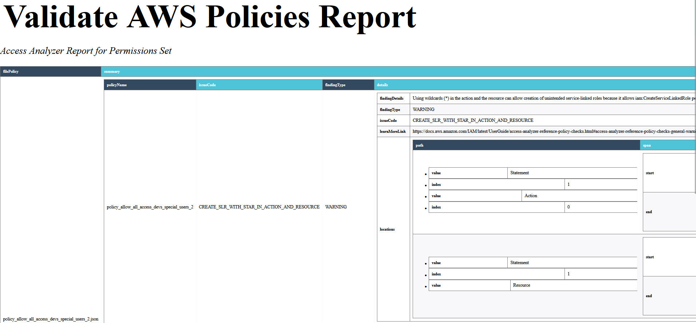

# Validate AWS policies 

This package scan **AWS SCP** policies and create report in HTML and PDF format.

# Pre-Requirements
Setup AWS Cli profile for interacting with IAM access analyzer API using IAM or SSO credentials.

# Requirements 

- python >= 3.8

## Install
### From AWS CodeArtifacts repository

>You must have a user into AWS account Sophos Organization, it could be for projects, products, or IT internal Organizations.
> Before create AWS CLI profile using [AWS IAM Identity Center (SSO)](https://docs.aws.amazon.com/cli/latest/userguide/sso-configure-profile-token.html) or IAM.
{.is-info}

1. Configure your pip cli for download package from private CodeArtifacts repository 

```commandline 

$ aws codeartifact login --tool pip --repository <repository_name> --domain <domain> --domain-owner <123456789012>  --profile <profile_name> --region <repository_region>
$ pip install --upgrade validate-aws-policies

```
### From Azure Artifacts repository

#### Project setup
Ensure you have installed the latest version of the Azure Artifacts keyring from the "Get the tools" menu.

If you don't already have one, create a virtualenv using [these instructions](https://go.microsoft.com/fwlink/?linkid=2103878) from the official Python documentation. Per the instructions, "it is always recommended to use a virtualenv while developing Python applications."

Add a pip.ini (Windows) or pip.conf (Mac/Linux) file to your virtualenv

```
[global]
index-url=https://pkgs.dev.azure.com/<organizations>/.../_packaging/.../pypi/simple/

```
Finally, install Packages.

```commandline
$ pip install --upgrade validate-aws-policies
```

# Instructions

 ```commandline
 validate-aws-policies -h
usage: validate-aws-policies [-h] [-c] [-u UPLOAD_REPORT] [-b] [-d DIRECTORY_POLICIES_PATH] [-p PROFILE] [-z] [-cp] [-v]

options:
  -h, --help            show this help message and exit
  -c, --ci              Run into pipeline if it's present
  -u UPLOAD_REPORT, --upload_report UPLOAD_REPORT
                        Upload reports to s3 bucket
  -b, --bucket_name     Use this flag for setting the bucket tool if --upload_report is present.
  -d DIRECTORY_POLICIES_PATH, --directory_policies_path DIRECTORY_POLICIES_PATH
                        Path where Policies are defined in json format
  -p PROFILE, --profile PROFILE
                        AWS cli profile for Access Analyzer Api
  -z, --zip_reports     Set in True if you want to create a zip file for reports
  -cp, --create_pdf_reports
                        Set it if you want to create a pdf report, this need wkhtmltopdf file for reports
  -v, --version         Print the package version
```
# Examples 


```commandline
validate-aws-policies -d project_configurations/policies/ -p sh-devsecops
```


The previous command create a report in the current folder with the syntax name: `AccessAnalyzerReport_2023-06-26 155116.844676.html`.
For example:




## Extras
### Enable autocomplete
Argcomplete provides easy, extensible command line tab completion of arguments for your Python application.

It makes two assumptions:

* You’re using bash or zsh as your shell

* You’re using argparse to manage your command line arguments/options

Argcomplete is particularly useful if your program has lots of options or subparsers, and if your program can dynamically suggest completions for your argument/option values (for example, if the user is browsing resources over the network).
Run: 
```bash
activate-global-python-argcomplete
```
and to make sure that bash knows about this script, you use
```bash

echo 'eval "$(register-python-argcomplete validate-aws-policies)"' >> ~/.bashrc
source ~/.bashrc

```